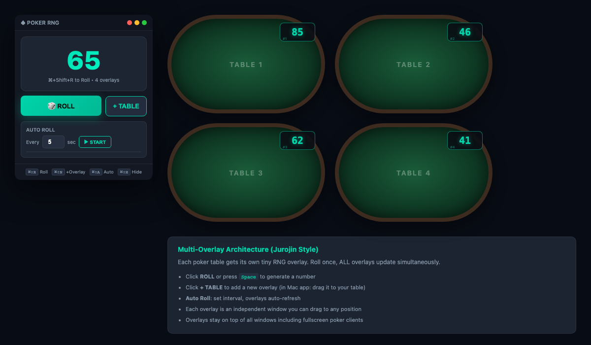
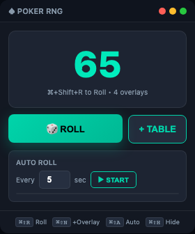
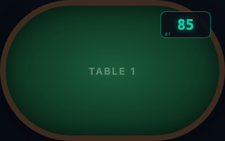

# Poker RNG for Mac

类似 Windows 上 Jurojin 的 Poker 随机数生成器，专为 Mac 用户打造。

## 截图

### 整体效果：控制面板 + 多桌浮层



### 控制面板



### 牌桌上的 Mini Overlay



## 架构

```
┌─────────────────┐      ┌──────────┐
│  Control Panel  │──────▶│ Overlay #1│ ← 拖到牌桌1
│                 │      └──────────┘
│  - Roll 按钮    │      ┌──────────┐
│  - Auto Roll    │──────▶│ Overlay #2│ ← 拖到牌桌2
│  - Range 设置   │      └──────────┘
│  - Overlay 管理 │      ┌──────────┐
│                 │──────▶│ Overlay #3│ ← 拖到牌桌3
└─────────────────┘      └──────────┘
```

每个牌桌一个独立的 mini 浮层，随机数完全隔离互不影响。

## 功能特性

- **多浮层架构**: 每个牌桌一个独立 RNG overlay，数字互不干扰
- **密码学安全随机数**: 使用 `crypto.randomBytes`，确保不可预测
- **可调范围**: 默认 1-100，支持自定义
- **Auto Roll**: 定时自动生成，可设间隔秒数（1-300秒）
- **独立操作**: 点击浮层数字只重新生成该浮层的随机数
- **可调大小**: 浮层支持拖拽缩放，数字自动适配窗口尺寸（最小 50x30，最大 300x160）
- **始终置顶**: screen-saver 层级，覆盖全屏应用
- **跨桌面可见**: 所有 Space / 全屏空间都能看到
- **方便关闭**: hover 浮层时右上角显示关闭按钮

## 快捷键

| 快捷键 | 功能 |
|--------|------|
| `⌘+Shift+R` | Roll 所有浮层（每个独立生成） |
| `⌘+Shift+N` | 添加新浮层 |
| `⌘+Shift+A` | 切换 Auto Roll |
| `⌘+Shift+H` | 显示/隐藏控制面板 |
| 点击浮层数字 | 只 Roll 该浮层 |

## 浮层操作

| 操作 | 说明 |
|------|------|
| 拖拽边框 | 移动浮层位置 |
| 拖拽边缘/角 | 调整浮层大小 |
| 点击数字 | 重新生成该浮层随机数 |
| hover 右上角 ✕ | 关闭该浮层 |

## 使用方式

```bash
# 安装依赖
npm install

# 启动
npm start
```

### 使用流程

1. 启动后出现控制面板
2. 点击 **+ TABLE** 添加浮层（开几桌加几个）
3. 把每个 mini overlay 拖拽到对应牌桌位置
4. 根据需要调整浮层大小
5. 按 `⌘+Shift+R` 或开启 Auto Roll
6. 看浮层上的数字做决策

## 打包为 .app

```bash
npm run build
```

生成 `dist/Poker RNG-1.0.0-arm64.dmg`，双击安装即可。

## 系统要求

- macOS 10.15+ (arm64 / Intel)
- Node.js 16+

## 技术栈

- Electron 28
- crypto.randomBytes (密码学安全 RNG)
- macOS vibrancy + screen-saver 层级
- 全局快捷键 (globalShortcut)

## License

MIT
